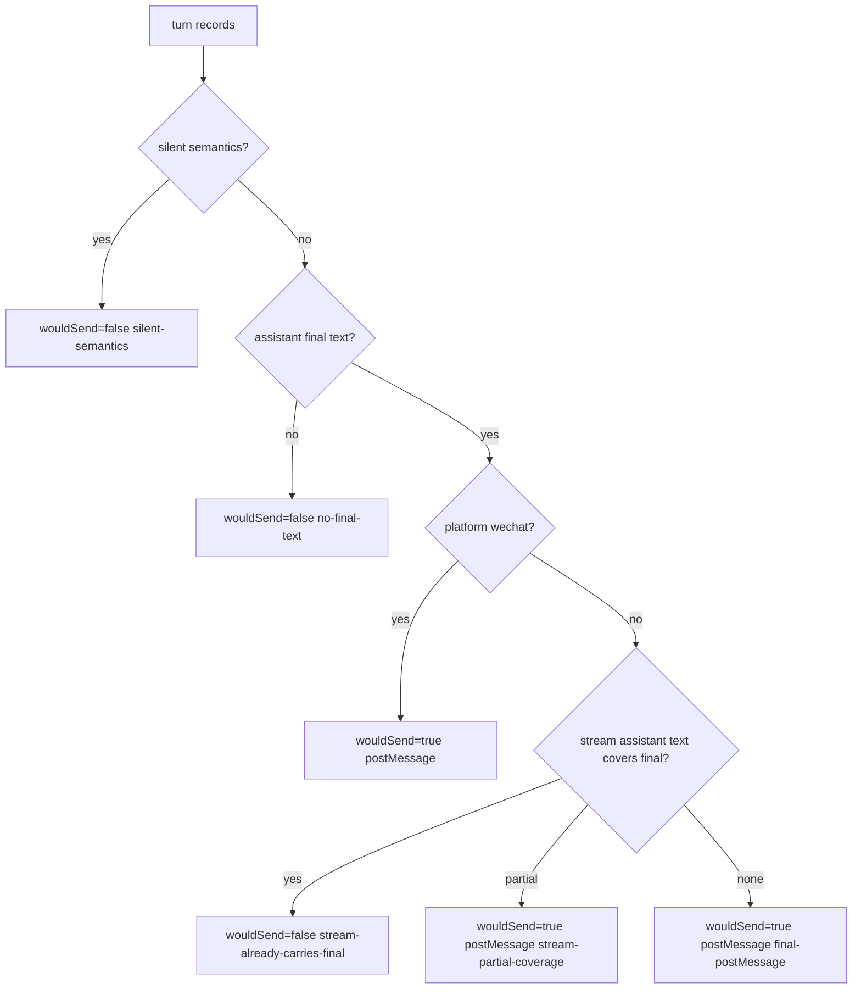

# Turn Delivery Architecture

Stage 1 implements typed egress shadow mode only. It records what the current scheduler and Slack subscribers already did, then computes what the future D orchestrator would have done. It does not change `sendReply`, `appendStream`, `emitPayloadWithCapabilityFallback`, `EgressGate.admit`, Slack formatting, Block Kit generation, worker IPC, or WeChat delivery.

## Current Shape

The audit in `profiles/karry/data/lessons/architecture/turn-text-egress-architecture-deep-audit-2026-04-29.md` describes the current double-owner problem:

```mermaid
flowchart TD
  U[Slack user message] --> SA[SlackAdapter._handleMessage]
  SA --> SCH[Scheduler.submit / _spawnWorker]
  SCH --> W[worker.js Claude stream-json]
  W -->|cc_event text/tool_use/result| SCHMSG[Scheduler onMessage]
  W -->|turn_complete text| SCHMSG

  SCHMSG --> EB[EventBus.publish]
  EB --> QI[Qi/Plan subscriber]
  EB --> TXT[Text subscriber]

  QI -->|tool_use| START[Slack chat.startStream]
  START --> TCS[turn.taskCardState.streamId]
  QI -->|tool_use| AST[Slack chat.appendStream task chunks]
  QI -->|result| STOP[Slack chat.stopStream]

  TXT -->|cc_event text + streamId| ATXT[Slack chat.appendStream markdown_text]
  ATXT --> EG1[turn.egress.admit(text,'intermediate')]
  ATXT --> TD1[markStreamDelivered -> turnDelivered=true]

  SCHMSG -->|turn_complete| TC[Scheduler turn_complete handler]
  TC --> EG2[turn.egress.admit(fullText,'final')]
  EG2 -->|admitted| BUILD[adapter.buildPayloads]
  BUILD --> EMIT[emitPayloadWithCapabilityFallback]
  EMIT -->|normal| POST[Slack chat.postMessage]
```

The important flaw is that Slack stream append and scheduler final postMessage are both user-visible assistant text egress paths. Legacy booleans and `EgressGate` are safety valves, not a typed delivery ledger.

## Typed Intents

Stage 1 records these intent strings:

- `assistant_text.delta`: assistant text appended to a stream.
- `assistant_text.final`: scheduler final text candidate for postMessage/edit delivery.
- `task_progress.start`: task/progress stream created.
- `task_progress.append`: task/progress stream appended.
- `task_progress.stop`: task/progress stream stopped.
- `control_plane.message`: approval or control-plane message posted.
- `control_plane.update`: approval or control-plane card updated.
- `metadata.status`: non-delivery metadata or shadow assertion records.
- `metadata.title`: thread title metadata.
- `receipt.silent_suppressed`: successful silent turn suppressed by channel semantics.

Each `TurnDeliveryRecord` includes turn identity, platform, delivery channel, text length, stable fingerprint, Slack timestamps when known, source, and free-form metadata.

## Slack Strategy

The future D orchestrator decision model shadowed in stage 1 is:



Stream coverage is intentionally conservative in shadow mode: a stream delta must have matching first-1000-character fingerprint and high length coverage to suppress final postMessage. Partial stream output must still allow final postMessage.

## Cross Platform

Slack has both stream and postMessage channels, so assistant text can be represented as either `deliveryChannel='stream'` or `deliveryChannel='postMessage'`.

WeChat has no stream adapter path today. Stage 1 only observes final `postMessage`-style delivery for WeChat and does not report stream/postMessage consistency diffs for that platform.

## Stage 1 Scope

Stage 1 adds:

- `src/turn-delivery/intents.js`
- `src/turn-delivery/shadow-recorder.js`
- read-only `shadowRecorder.observe(...)` calls at existing scheduler and Slack subscriber/control-plane call sites
- shadow consistency assertion after `turn_complete`
- focused architecture tests
- daily NDJSON output under `profiles/{name}/data/shadow-egress/`

The recorder never throws into callers. Schema failures are warnings in non-production mode, and NDJSON append failures are logged only.

## Roadmap

Stage 2 can route real assistant text egress through a typed orchestrator after at least seven days of clean shadow observation.

Stage 3 can remove legacy bridge state and replace `EgressGate` as the final ownership mechanism once the typed orchestrator is authoritative.
