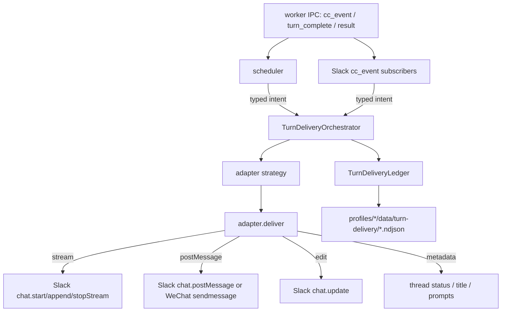

# Channel-Typed Egress Orchestrator

Orb uses `TurnDeliveryOrchestrator` as the single owner for user-visible turn output. Scheduler lifecycle handlers and Slack cc_event subscribers emit typed intents; adapters expose `deliver(intent, ctx)` as the only place where platform APIs are invoked.

## Intent Schema

Every intent includes:

- `turnId`: stable turn identity, usually worker `turnId` or `threadTs#attemptId`
- `attemptId`: scheduler attempt id, used for replay de-duplication
- `channel`: platform channel or WeChat user id
- `threadTs`: delivery thread timestamp or WeChat peer id
- `platform`: `slack`, `wechat`, or another adapter platform
- `channelSemantics`: `reply`, `broadcast`, or `silent`
- `intent`: one of the typed intent names below
- `text`: optional user-visible text
- `source`: producer name such as `subscriber.text` or `scheduler.turn_complete`
- `meta`: structured delivery metadata, including stream chunks, git diff summary, edit ts, loading messages, or local sequence ids

Intent types:

- `assistant_text.delta`: streamed assistant text chunk
- `assistant_text.final`: final assistant text for the turn
- `task_progress.start`: create or attach the task progress stream
- `task_progress.append`: append task progress chunks to the existing stream
- `task_progress.stop`: settle the task progress stream
- `control_plane.message`: independent operational message, approval card, warning, or continuation marker
- `control_plane.update`: update an existing control-plane message
- `metadata.status`: thread status bubble
- `metadata.title`: thread title and suggested prompts
- `receipt.silent_suppressed`: internal receipt for silent assistant text suppression

## Strategy

The strategy is platform-agnostic and reads only adapter capabilities plus turn state:

- `channelSemantics === "silent"` turns assistant text into `receipt.silent_suppressed`; no adapter API is called.
- `control_plane.message` uses `postMessage`; `control_plane.update` uses `edit`.
- `metadata.status` and `metadata.title` use `metadata`.
- `task_progress.*` uses `stream` when `capabilities.stream` is true; otherwise it is recorded silently.
- `assistant_text.delta` uses `stream` only when a stream exists.
- `assistant_text.final` uses `stream` when a stream exists, otherwise `postMessage`.
- If stream delivery fails, the final assistant text is delivered once via `postMessage`, followed by a `control_plane.message` continuation marker.

## Cross-Turn Cases

- Inject: each worker `turn_start` calls `beginTurn` with the new `attemptId`; same-thread follow-up turns get fresh state.
- Cron silent: `channelSemantics: "silent"` produces only `receipt.silent_suppressed` ledger records for assistant text.
- SIGTERM replay: delivered keys include `turnId`, `attemptId`, intent, channel, source, and sequence where needed, so a replayed attempt is skipped.
- Stream failure: failed stream state is stored on the turn; final text falls back to one assistant post and an explicit continuation marker.
- WeChat: `capabilities.stream` is false, task progress is not externally emitted, and final assistant text uses the same post-message path backed by `sendmessage`.

## Ledger

`TurnDeliveryLedger` is the authoritative delivery ledger and the production audit writer. Each record is written as one NDJSON line under:

`profiles/{profile}/data/turn-delivery/turn-delivery-YYYY-MM-DD.ndjson`

Record fields:

- `turnId`, `attemptId`, `channel`, `threadTs`, `platform`
- `intent`, `deliveryChannel`
- `textLen`
- `streamMessageTs`, `postMessageTs`
- `createdAt`, `source`, `meta`

The ledger stores delivered typed keys in memory and records every orchestrator decision that matters for auditing. It does not compare message text to decide whether delivery is allowed.

## Removed Legacy Ownership

The previous split ownership had Slack subscribers appending stream text while scheduler independently posted final text. That made duplicate user-visible replies possible. The current architecture removes string-based delivery gates and per-turn delivery booleans from the delivery decision. Subscribers and scheduler no longer call Slack message APIs directly; they emit typed intents.

Kept pieces:

- Worker IPC payloads stay unchanged.
- Slack `startStream`, `appendStream`, `stopStream`, `sendReply`, and `editMessage` remain adapter methods, called from `SlackAdapter.deliver`.
- `turn.taskCardState.streamId` remains adapter UI state and is synchronized by the orchestrator.
- The scheduler keeps `userVisibleDeliveryObserved` only to suppress abnormal-exit warnings after visible delivery has been observed.

## Test Invariants

1. 1053/1062 stream/final sample does not create an assistant post duplicate.
2. Short final without stream posts once.
3. Silent cron turns emit a silent receipt and no message.
4. Injected turns reset turn-level delivery state.
5. Same-attempt replay is skipped.
6. Stream failure falls back to final reply plus continuation marker.
7. WeChat final output uses sendmessage and has no stream calls.
8. Control-plane messages are physically separate from assistant text.
9. Metadata updates do not create new messages.
10. Duplicate final emits are skipped by typed record state.
11. Abnormal-exit warnings are suppressed only after visible delivery.
12. Scheduler routes turn output through the orchestrator.
13. Slack subscribers route output through the orchestrator.
